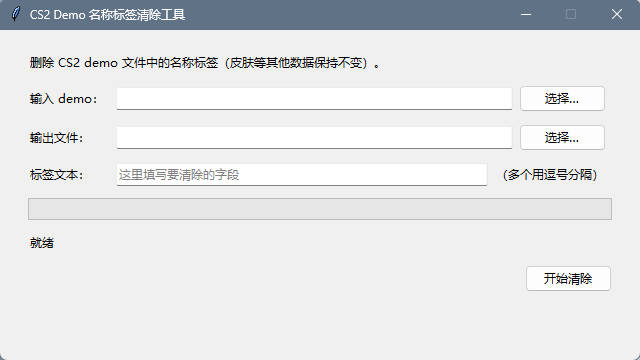

# CS2 Demo Name Tag Remover

[中文](#中文) · [English](#english)



---

## 中文

一个小工具，用于删除 CS2 demo 文件（`.dem`）中的饰品名称标签。

CS2 的饰品可以带一个自定义名称（名称标签），这段文字会被写进 demo 的实体数据，
回放时所有观看者都能看到。本工具把你指定的文字从 demo 里删掉——皮肤等其他数据
保持不变。纯 Python 实现，仅依赖标准库。

### 功能

- 删除任意指定的文字，可一次指定多个
- 同步修正每个实体的位长度表（`serialized_entities`），清除后的 demo 仍能正常播放，详见[原理](#原理简版)
- 无法安全缩短的位置会被统计并原样保留
- 输出为新文件，不修改原始文件
- 图形界面（支持拖拽）与命令行两种用法

### 使用方法

**方式一：直接运行 exe（推荐，无需安装 Python）**

下载 `CS2DemoTagRemover.exe`，双击打开，然后：

1. 点「选择…」选中要处理的 `.dem` 文件——也可以直接把 `.dem` 文件拖到 exe 图标上
2. 在「标签文本」里填写要清除的文字（多个用逗号分隔）
3. 点「开始清除」，完成后生成 `原文件名_cleaned.dem`

**方式二：从源码运行**

图形界面：

```
python gui.py
```

命令行：

```
python cli.py input.dem --tag "要清除的文字"
python cli.py input.dem output.dem --tag "要清除的文字"
python cli.py input.dem --tag "文字一" --tag "文字二"
```

参数：

- `--tag TEXT` — 要清除的文字（必填，可重复指定以一次清除多个）
- 省略输出文件时默认写入 `<输入文件名>_cleaned.dem`

处理一个 256 MB 的 demo 约需 30~40 秒（主要耗时在逐帧解压扫描）。

### 环境要求

- 运行 exe：无需任何环境
- 从源码运行：Python 3.8+（仅标准库，无第三方依赖）

### 自行打包 exe

```
pip install pyinstaller
python -m PyInstaller --onefile --windowed --name CS2DemoTagRemover gui.py
```

产物为 `dist/CS2DemoTagRemover.exe`，单文件，可直接分发。

### 原理（简版）

- CS2 demo（`PBDEMS2`）是帧流：`varint(cmd) varint(tick) varint(size) data`，帧数据可用 snappy 压缩。
- `DEM_Packet` / `DEM_SignonPacket` / `DEM_FullPacket` 内含按位打包的网络消息*容器*；饰品自定义名称位于 `svc_PacketEntities.entity_data` 的实体位流中，位偏移任意。
- 定位文字：对 8 种位偏移构造"后缀字节模式"，用 `bytes.find` 做 C 级搜索，命中后逐位验证。
- 删除这段文字的比特位（保留结尾的 NUL），名称解码为空字符串——游戏不会渲染任何内容（若替换成空格则会显示带引号的 `"   "`）。
- `svc_PacketEntities` 还带有 `serialized_entities`：每个被更新的实体一个 varint，值为该实体字段数据的**位长度**。CS2 依赖它定位每个实体的数据块，因此对应条目必须减去删掉的位数；否则播放时会崩溃并提示 `FATAL ERROR: Failed to parse delta header for Packet Entities`。
- 删除使 payload 变短，因此同步重写所有外层长度前缀：protobuf 字段长度、容器内消息大小（容器尾部的填充位原样保留）、文件头部的两个长度字段。

### 已知限制

- 只删除位于实体字段数据内部的文字。出现在别处（例如赛后饰品统计消息）的文字会被统计并提示，但不做修改。
- 若某帧的实体位流与其位长度表不吻合，该帧原样保留而不重写。
- 一次处理一个文件；输入输出不能是同一路径。

### 许可证

MIT — 见 [LICENSE](LICENSE)。

---

## English

A small tool that removes item name tags from CS2 demo files (`.dem`).

A CS2 item can carry a custom name (a name tag). That text is written into the
demo's entity data, so everyone watching the replay sees it. This tool deletes
the text you specify from the demo — skins and all other data are left
untouched. Pure Python, standard library only.

### Features

- Removes any text you specify, several at once if needed
- Keeps the per-entity bit-length table (`serialized_entities`) in sync, so the
  cleaned demo still plays — see [How it works](#how-it-works-short-version)
- Anything it cannot shorten safely is reported and left byte-identical
- Writes a new file; the input is never modified
- GUI (drag & drop) and CLI

### Usage

**Option 1: run the exe (recommended, no Python needed)**

Download `CS2DemoTagRemover.exe` and double-click it, then:

1. Pick the `.dem` file — or drag a `.dem` file straight onto the exe icon
2. Type the text to remove into the tag field (comma-separated for several)
3. Click the start button; the result is written to `<input>_cleaned.dem`

**Option 2: run from source**

GUI:

```
python gui.py
```

Command line:

```
python cli.py input.dem --tag "TEXT TO REMOVE"
python cli.py input.dem output.dem --tag "TEXT TO REMOVE"
python cli.py input.dem --tag "FIRST" --tag "SECOND"
```

Options:

- `--tag TEXT` — the text to remove (required; repeat it to remove several)
- Omit the output file to write `<input>_cleaned.dem`

A 256 MB demo takes roughly 30–40 s (most of the time is spent decompressing
and scanning every frame).

### Requirements

- Running the exe: nothing
- Running from source: Python 3.8+ (standard library only, no third-party packages)

### Building the exe yourself

```
pip install pyinstaller
python -m PyInstaller --onefile --windowed --name CS2DemoTagRemover gui.py
```

The result is a single self-contained `dist/CS2DemoTagRemover.exe`.

### How it works (short version)

- CS2 demos (`PBDEMS2`) are a stream of frames: `varint(cmd) varint(tick) varint(size) data`, optionally snappy-compressed.
- `DEM_Packet` / `DEM_SignonPacket` / `DEM_FullPacket` carry a bit-packed *container* of net messages; item custom names live in the entity bit stream of `svc_PacketEntities.entity_data`, at an arbitrary bit alignment.
- The text is located by building 8 bit-shift "suffix patterns" searched with C-level `bytes.find`, then verified bit-by-bit.
- Its bits are deleted (the trailing NUL stays), so the custom name decodes to an empty string — the game renders nothing (replacing with spaces would show quoted `"   "` instead).
- `svc_PacketEntities` also carries `serialized_entities`: one varint per updated entity holding the **bit length** of that entity's field data. CS2 uses it to find each entity's chunk, so the matching entry is shrunk by exactly the number of deleted bits. Without that, playback dies with `FATAL ERROR: Failed to parse delta header for Packet Entities`.
- Deleting bits shrinks the payload, so every enclosing length prefix is rewritten: protobuf field lengths, container message sizes (the container's trailing padding bits are preserved), and the two length fields in the file header.

### Limitations

- Only text inside an entity's field data is removed. An occurrence elsewhere (for example in the end-of-match econ message) is counted and reported, not touched.
- A frame whose entity stream does not match its size table is left byte-identical rather than rewritten.
- One file at a time; input and output must be different files.

### License

MIT — see [LICENSE](LICENSE).
